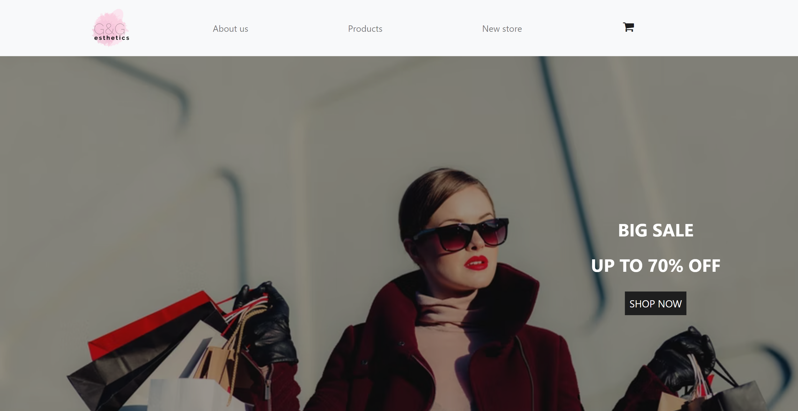

# freeCodeCamp - Product Landing Page
This is a solution for the [Product Landing Page project on freeCodeCamp](https://www.freecodecamp.org/learn/responsive-web-design/responsive-web-design-projects/build-a-product-landing-page).

# Screenshot

# Links

- Solution URL: https://github.com/denisazaharia98/freeCodeCamp-Responsive-Web-Design-Projects/tree/main/Product%20Landing%20Page
- Live Site URL: https://denisazaharia98.github.io/freeCodeCamp-Responsive-Web-Design-Projects/Product%20Landing%20Page/

# Built with

- Semantic HTML5 markup
- CSS custom properties
- Flexbox
- Bootstrap
- JavaScript

#Useful resources

- https://alvarotrigo.com/blog/css-animations-scroll/
- https://www.youtube.com/watch?v=xuA83OYTE7I&ab_channel=dcode
