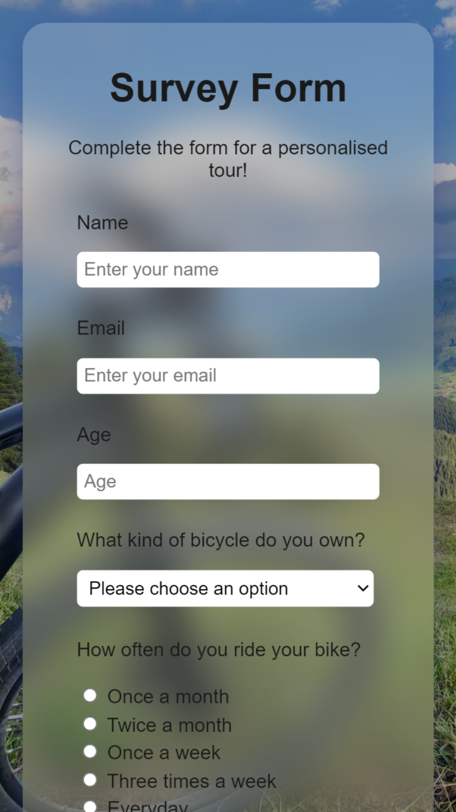
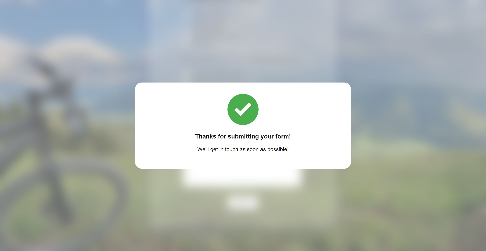

# freeCodeCamp - Survey Form Page
This is a solution to the [Survey Form Page project on freeCodeCamp](https://www.freecodecamp.org/learn/responsive-web-design/responsive-web-design-projects/build-a-survey-form)

# Screenshot

# Links

- Solution URL: https://github.com/denisazaharia98/freeCodeCamp-Responsive-Web-Design-Projects/tree/main/Survey%20Form%20Page
- Live Site URL: https://denisazaharia98.github.io/freeCodeCamp-Responsive-Web-Design-Projects/Survey%20Form%20Page/

# Built with

- Semantic HTML5 markup
- CSS custom properties
- Flexbox
- JavaScript
